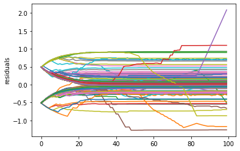
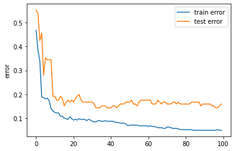
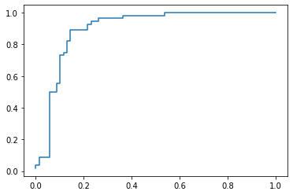
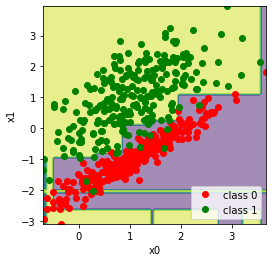

# Gradient-Boosting-Machine

You can follow me on YouTube and write this ML algorithm from scratch in Python

GBM is an enssemble ML algorithm, based on not deep, followed Decision Tree, wich decrease resudials in prediction one by one.
It is written in Pythom from scratch as well as Decision Tree.

It is suitable to solve regression and classification problems, plots pseudo residuals

Plots train and test errors

ROC curve and classification results

